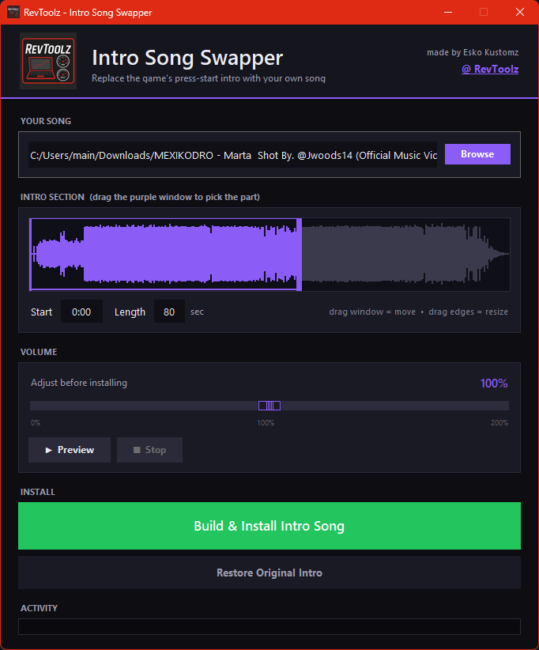

# Intro Song Swapper - Forza Horizon 6

**Replace the Forza Horizon 6 "press start" intro music with any song you want.**

Made by **Esko Kustomz @ RevToolz** - https://eskokustomz.com/revtoolz

<p align="center">
  
</p>

---

## ✨ What it does

Swaps the song in the game's startup/"press start" intro for your own MP3, WAV, FLAC, etc. - with a visual waveform editor so you can pick the exact part of the song that plays, adjust the volume, and preview it live before installing. It finds your game automatically, backs up the original, and installs the new one in one click.

- 🎵 Use **any** audio file (MP3, WAV, FLAC, OGG, M4A, AAC)
- 🌊 **Waveform picker** - drag a window to choose which part of the song plays (like Instagram/TikTok)
- ▶️ **Live preview** - hear it loop exactly like the game does, with a moving playhead
- 🔊 **Live volume** - adjust loudness while it plays
- 💾 **Auto backup** - your original intro is saved so you can restore it any time
- 🔎 **Auto-detect** - finds both **Steam** and **Xbox / Game Pass** installs
- ↩️ **One-click restore** - put the original back whenever you want

---

## 🚀 How to use

1. **Run `FH6IntroSongSwapper.exe`.**
   (Windows may show a SmartScreen warning - see *Troubleshooting* below. Click **Yes** on the admin prompt; it needs that to write to the game folder.)
2. Click **Browse** and choose your song. The waveform loads after a second or two.
3. **Drag the purple window** on the waveform to pick the part of the song you want.
   - Drag the **middle** to slide it • drag the **edges** to resize.
   - Or type a **Start** time (like `0:45`) and **Length** in the boxes.
4. Hit **▶ Preview** to hear it loop just like the menu. Drag the volume slider while it plays to set the level.
5. When it sounds right, click **Build & Install Intro Song**. Done - launch the game to hear it!

To go back to the original: click **Restore Original Intro**.

---

## ❓ Why only ~80 seconds?

The game's press-start screen has a **fixed-length music slot** (about 80 seconds) built into Forza itself - when it ends, the game loops it. This tool can't make the slot longer, so you choose the best ~80-second section of your song with the waveform picker. The tool adds a smooth fade so the loop sounds clean.

*(You only ever hear the loop if you sit on the press-start screen. Press Start normally and you'll just hear the beginning.)*

---

## 🛠️ Troubleshooting

**"Windows protected your PC" (SmartScreen)**
This is normal for new indie tools that aren't code-signed. Click **More info → Run anyway**. The tool is safe - it only touches the one intro audio file.

**Antivirus flags it**
False positive. Tools packaged this way (Python + PyInstaller) sometimes get flagged. Add an exception or grab the source if you'd rather build it yourself.

**"Windows blocked writing to the game folder"**
Right-click the exe → **Run as administrator** and try again.

**It didn't find my game**
If your install is in an unusual spot, the tool will ask you to locate `GLB_RadioPressStart.assets.bank` manually - point it at:
`...\Forza Horizon 6\Content\media\audio\fmodbanks\GLB_RadioPressStart.assets.bank`

**The song restarts in the middle**
Your section is longer than the game's slot. Shorten the **Length** a little, or just keep it around 80 seconds.

**It cuts off early / there's a silent gap before it loops**
Nudge the **Length** value - lower it if it cuts early, raise it if there's a gap.

---

## 🔄 Updates

If a **game update** ever stops the tool from working, the intro file's internal ID may have changed. Report it on the release page and an updated version will be posted.

---

## 🧩 Building from source

Don't trust a random .exe? Build it yourself — it's open source.

**Requirements:** Windows + [Python 3.10+](https://www.python.org/downloads/) (tick *"Add Python to PATH"* during install).

**Easy way:** double-click **`build.bat`**. It installs everything and produces `dist\FH6IntroSongSwapper.exe`.

**Manual way:**
```bat
pip install -r requirements.txt
python -c "import imageio_ffmpeg, shutil; shutil.copy(imageio_ffmpeg.get_ffmpeg_exe(), 'ffmpeg.exe')"
pyinstaller --onefile --windowed --name FH6IntroSongSwapper --icon revtoolz.ico --add-binary "ffmpeg.exe;." --add-data "revtoolz.ico;." --add-data "revtoolz.png;." --collect-all sounddevice --exclude-module imageio_ffmpeg --exclude-module PIL --uac-admin --noconfirm FH6IntroSongSwapper.py
```

You can also just run it without building: `python FH6IntroSongSwapper.py`

**How it works:** the song is decoded with ffmpeg, your chosen ~80s section is wrapped in an FMOD FSB5 (PCM) container, and spliced into the game's `.bank` file with all size/offset fields fixed up — the original event data is preserved untouched.

---

## ⚠️ Disclaimer

This is a free, unofficial fan tool. Use at your own risk. It always backs up your original intro before changing anything, and you can restore it any time with one click. Not affiliated with or endorsed by the game's developers or publisher.

---

## 💜 Credits

**Esko Kustomz @ RevToolz**
🔗 https://eskokustomz.com/revtoolz

If you enjoy it, share it and tag **RevToolz**!
